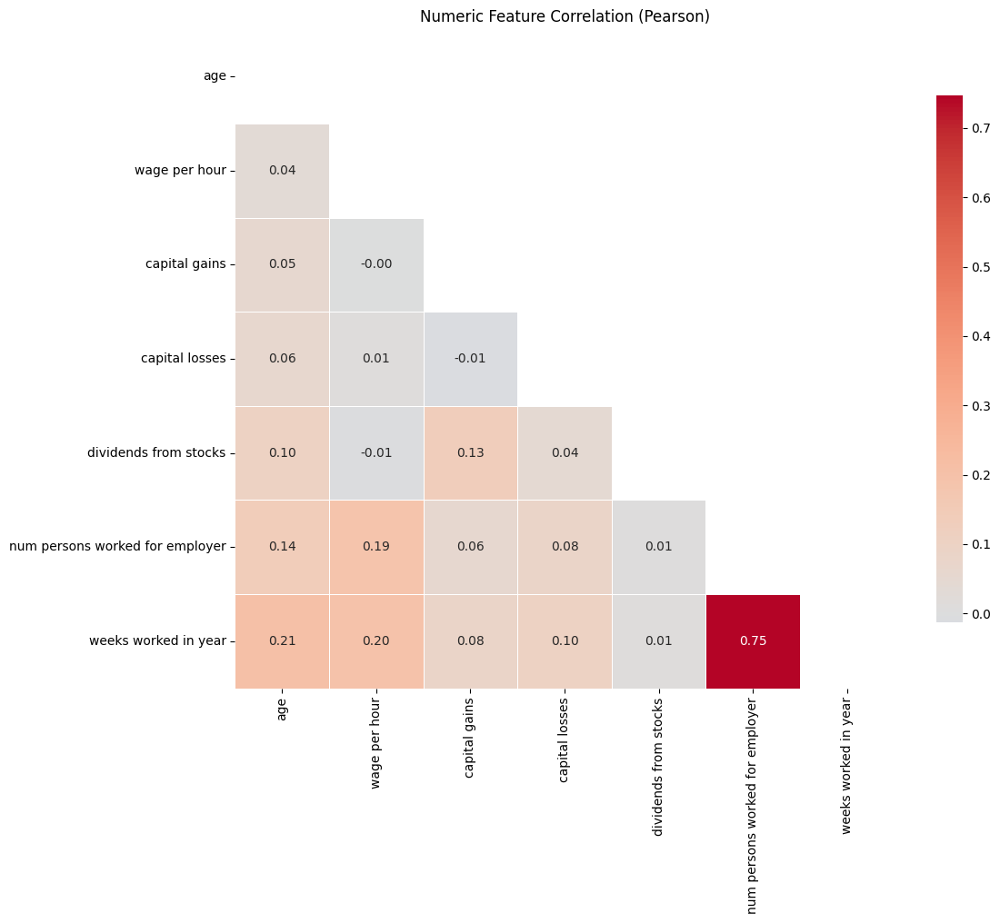
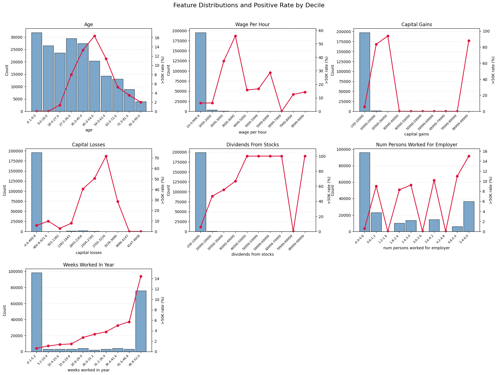
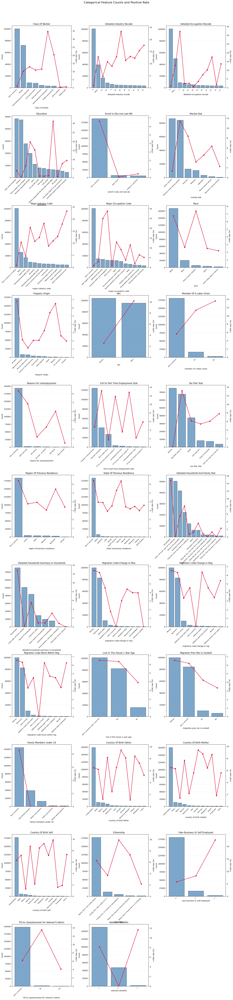
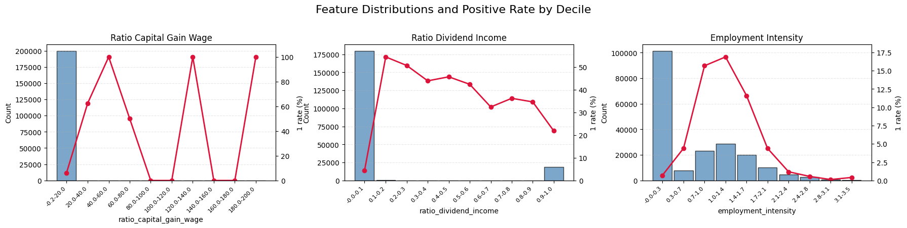

# Income Classification Take-Home Project

---

## 1. Executive Summary

- Built an income classification model (XGboost) predicting whether an individual earns **> \$50K** using the 1994/1995 Census Bureau survey.
- Delivered a **rule-based segmentation model** surfacing marketing-relevant persona groups (e.g., “High Wage Long Work� “Current Student�.
- Implemented reproducible preprocessing, model training, evaluation, and segmentation CLI workflows.
- Identified key drivers (capital gains, weeks worked, union membership, marital status) with actionable marketing implications.
---

## 2. Data Exploration & Understanding

| Item              | Description                                                                 |
|-------------------|-----------------------------------------------------------------------------|
| Data Source       | Census Bureau 1994/1995 Current Population Survey                           |
| Files             | `census-bureau.data` (raw), `census-bureau.columns` (schema)                |
| Records           | ~200K observations after preprocessing                                      |
| Target            | `label` �converted to binary (1: >50k, 0: <=50k)            |

### 2.1 Initial Analysis

- Data contains **40 demographic & employment variables** and non-predictors **weight, year, label**.  7 variables are numerical and the rest are categorical. The cardinality of categorical ranging from 2 to 51. Numerous categorical features exhibit high cardinality (e.g., prior residence, citizenship). If one-hot encoding every categorical variable, we will end up with approximately 500 features. Based on this observation, tree based model will be a good starting point.

- Missing values encoded as `"?"`, etc., and only in 9 categorical columns.

- Some categorical variables like "own business or self employed" and "vertan benefits" are originally encoded as number and hard to interpret. 

### 2.2 Data Quality Observations

- Low positive rate (around 6% with / without considering weight)

- Skewed distributions of capital gains/losses

### 2.3 Exploratory Data Analysis 

#### Correlation Check

I conducted the correlation check on numerical variables:
    "age",
    "wage per hour",
    "capital gains",
    "capital losses",
    "dividends from stocks",
    "num persons worked for employer",
    "weeks worked in year",

The only pair with high correlation is "weeks worked in year" and "wage per hour" and the possible reason is that both contain strong signal of the job intensity. Since we will start with Tree-based model, I am not taking any action on this for now.





#### Univariate Analysis

I conducted the univariate analysis on each variable by plotting the histogram (numerical variables) or barplots (categorical variables) against the positive rate. For categorical variable, I only plotted top 12 categories due to limited space.

Here are some findings: 

1. In general, all features show relationship with the label and there is no feature will be dropped at this step.

2. For numerical features
  - The distributions of "wage per hour", "capital gains", "capital losses" and "dividends from stocks" are skewed and all three variables show median to strong predictive power on response. Since we will start with tree based model, so I will not apply any transformation to address the distribution issue. May consider log transformation if we are trying Linear model or NN in the future.

  - Age distribution looks like half pyramid which is expected in demographic research. The middle-age population have higher positive rate.

  - The variable "num persons worked for employer" has most value as 0 and 1 and show  slight trend that multi-employer workers having slightly higher income.

3. For categorical features
  - Employment status: Self-employed and government employees have higher positive rate.  

  - Occupation and Industry: The majority of people fall into service, trade, or manufacturing sectors.Professional / managerial occupations exhibit the highest positive rates, while handlers, laborers, and clerical roles show below-average income probability.

  - Education:  Strong monotonic relationship: positive rate rises sharply from High School to Bachelors to Graduate degrees.

  - Marital Status & Household:  Structure Married-civilian spouse present the single strongest categorical predictor, with the highest positive rate. Never married and Separated / divorced groups underperform substantially.

  - Citizenship & Migration Codes: Non-citizens and recent movers show lower income rates.


  - Sex & Race: Males have substantially higher >50K rates than females. Race variable shows skew: White is the dominant group, but positive rate differences exist, with Asian/Pacific Islander showing a slightly higher rate than average.

 






## 3. Preprocessing Approach and Feature Engineering

| Step                   | Description                                                                 |
|------------------------|-----------------------------------------------------------------------------|
| Missing Value Handling | High-missing categorical columns imputed with "Missing"|
| Feature Engineering    | Added `ratio_capital_gain_wage`, `ratio_dividend_income`, `employment_intensity` |
| Type Casting           | Categorical columns converted to `category` dtype, then mapped to deterministic integer codes |
| Test Split             | Stratified **80/20** train-test (configurable via CLI)                      |
| Outputs                | Saved to `assets/processed_classification/` and consolidated `assets/processed/data.parquet` |

CLI:

```bash
poetry run preprocess \
  --data-dir assets/raw \
  --output-dir assets/processed \
  --test-size 0.2 \
  --random-state 42
```

#### Feature Engineering

**ratio_capital_gain_wage**: capital gains divided by wage per hour, with zero wages treated as missing to avoid division by zero; missing/inf values filled with 0.


**ratio_dividend_income**: dividends from stocks divided by the sum of capital gains and dividends, capturing what portion of investment income comes from dividends; safeguards remove inf/NaN and default to 0.

**employment_intensity**: weeks worked in the year divided by age (ignoring age 0), giving a rough measure of work intensity relative to age, with invalid values coerced to 0.



## 4. Classification Model

**Architecture & Features**

- Model: **XGBoost binary classifier** (hist tree method, categorical support enabled). XGBoost was selected because it delivers state-of-the-art performance on tabular data, supports sample weights and imbalance handling, requires minimal feature engineering, and remains interpretable.

- Feature Selection: Click option `--reduce-method` supports mutual information, ExtraTrees, or full features; default is ExtraTrees with `n_features=20`.
- Sample weights integrated end-to-end (train/test CV, final fit).

- The selected model is saved at  **xgb_select_25_by_extra-trees__stop_auc_tune_hyperopt/v1**

**Training Process**

1. Load & Prepare Data

2. Create stratified 5-fold CV

3. Hyperparameter Tuning: Search space includes both feature selector and XGBoost parameters

    In each trial: select features �train model �score via CV and monitor ROC-AUC

    Hyperopt selects best parameters; otherwise use default parameters

4. Final Model Fit: 

    Refit selector on full dataset, keep final feature list

    Train XGBoost with tuned params and apply sample weights

5. Log & Register Model using MLflow to manage version

**Model Parameters** 
| Parameter                | Value                      |
|--------------------------|----------------------------|
| objective                | `'binary:logistic'`        |
| base_score               | `np.float64(0.06206066984926512)` |
| colsample_bytree         | `0.6309389726155841`       |
| enable_categorical       | `True`                     |
| gamma                    | `19.813806244400894`       |
| learning_rate            | `0.0721885584727348`       |
| max_bin                  | `180`                      |
| max_depth                | `6`                        |
| min_child_weight         | `2.0`                      |
| n_estimators             | `210`                      |
| random_state             | `42`                       |
| reg_alpha                | `14.0`                     |
| scale_pos_weight         | `2.0`                      |
| subsample                | `0.6957148397686791`       |
| tree_method              | `'hist'`                   |


**Selected Features (25 intotal)**

Selected the following features:

- Work Intensity & Experience �weeks worked in year, employment_intensity, wage per hour, num persons worked for employer, full or part time employment stat, member of a labor union, reason for unemployment, enroll in edu inst last wk

- Income Streams �capital gains, dividends from stocks, capital losses, ratio_capital_gain_wage, ratio_dividend_income

- Occupation & Industry �detailed occupation recode, major occupation code, detailed industry recode, major industry code, class of worker, detailed household and family stat, detailed household summary in household
Household & Family Context �family members under 18, marital stat

- Demographics �age, education, race


**Preliminary Results**

| Split   | Accuracy | ROC AUC | Recall | Precision | F1   |
|---------|----------|---------|--------|-----------|------|
| Train   | 0.958    | 0.966   | 0.640  | 0.686     | 0.662 |
| Holdout | 0.953    | 0.951   | 0.585  | 0.647     | 0.614 |


1. Overall performance is stable across train and holdout. Accuracy, F1 and ROC-AUC drop very slightly from train to holdout. This indicates good generalization with no obvious overfitting.


2. Recall is noticeably lower than precision. The model is confidence on predicting positive, but it does not catch all positives. This is typical in imbalanced datasets where the positive class is rare, and the model leans toward caution.

3. F1 score reflects a precision–recall trade-off and overall performance. F1 decreases from 0.662 (train) to 0.614 (holdout), a modest drop consistent with expected generalization loss. Since F1 weighs both precision and recall, this confirms the model is reasonably balanced but still recall-limited.

4. To improve the recall we can try the following strategy in the future:

    - tuning decision threshold,

    - adjusting class weights (scale_pos_weight) to higher,

    - using cost-sensitive metrics in training,

    - oversampling / focal loss variants.

**Feature Importance**


---

## 5. Segmentation Model

For marketing segmentation purpose, I built a rule based model/strategy to split the popultion into subgroups. Due to the unknow purpose of downstream marketing target, I choose to do the Economic class-like clustering. If more information provided, other segmentation focus such as Job based, Race based and etc.


**Rule Hierarchy**

Rule-based personas fire in priority order (first match wins for each record): 

  1. Children (<16 years): Usually no income and very unlikely to be our target customers.

  2. CapitalIncomePresent (any capital gains or dividends): Capital income is a strong indicator of wealth and often correlates with higher total income and different financial behaviors than wage-only earners
  
  3. HighWage_FullTime (wage/hour >= 30 and weeks/year >= 40): Represents a distinct high-earning wage group, usually associated with skilled/managerial roles and strong labor market attachment.

  4. LowWage_FullTime (wage/hour <= 12 and weeks/year >= 40): A vulnerable group who work dedicately but need more support and opportunities.

  5. PartTime_or_ShortWeeks (part-time status or weeks/year <= 20, or low employment_intensity <=0.3): This group often exhibits lower annual income due to fewer hours/weeks; critical for labor supply and earnings analyses.
  
  6. HighEmploymentIntensity (employment_intensity �.9): Segments "work effort" apart from pay—useful for understanding wage dynamics, overtime, and attachment to labor force.
  
  7. Other


**Market Share Analysis**


| Segment                   | Population Share (No weight) | Population Share (Weighted)|
|---------------------------|------------------| ------------------| 
| LowWage_FullTime          | 0.285270         |0.289775 |
| Children                  | 0.252342         |0.241934 |
| PartTime_or_ShortWeeks    | 0.249194         |0.250936 |
| CapitalIncomePresent      | 0.132391         |0.133298 |
| HighWage_FullTime         | 0.038993         |0.040456 |
| HighEmploymentIntensity   | 0.022223         |0.023618 |
| Other                     | 0.019587         |0.019983 |


1. Low-wage and under-employment dominate the population

    LowWage_FullTime (�9%) and PartTime_or_ShortWeeks (�5%) together represent more than half of the dataset.

    This confirms a wage distribution that is bottom-heavy, with a large share of workers earning below the mid-wage threshold even when working full-year or part-year.

    The similarity between unweighted and weighted shares suggests these patterns are not driven by oversampling or survey design, but reflect true population structure.

2. Children make up roughly a quarter of the records

    The Children segment (~24�5%) is large because the dataset includes individuals outside the labor force. Excluding minors in downstream wage or employment models would materially change rate denominators, so flagging them early is important.

3. Capital-income earners are a distinct but minority group

    Only ~13% of the population reports any capital gains or dividend income. Despite being numerically smaller, this group typically displays much higher total income levels, making it analytically important even if small in count.

4. High-wage and high-intensity workers are rare

    HighWage_FullTime (�%) and HighEmploymentIntensity (�%) together account for less than 7% of the population. These groups are economically significant but statistically small, meaning appropriate downstream strategy may bring considerable financial impact.

5. The "Other" bucket is very small (~2%)

    This indicates the rule system has high coverage and only a small residual population remains uncategorized. A low "Other" share also increases interpretability and suggests rule ordering and thresholds were effective.


**Outputs & Usage**

Deliverables include **results/segmentation_rules/rule_segments.parquet** (row-level persona labels), **results/segmentation_rules/segment_profiles.parquet** (weighted segment summaries). 


### 5.6 Profiling

Weighted numeric means per segment 

| segment                 | mean_age | mean_wage per hour | mean_capital gains | mean_capital losses | mean_dividends from stocks | mean_num persons worked for employer | mean_weeks worked in year |
|-------------------------|---------:|-------------------:|-------------------:|--------------------:|----------------------------:|-------------------------------------:|--------------------------:|
| LowWage_FullTime        |  38.546  |             0.000  |             0.000  |              66.890 |                        0.000 |                                 3.775 |                    51.047 |
| PartTime_or_ShortWeeks  |  47.760  |            14.380  |             0.000  |              20.980 |                        0.000 |                                 0.724 |                     2.499 |
| Children                |   7.369  |             0.306  |             0.024  |               0.719 |                        0.033 |                                 0.029 |                     0.207 |
| CapitalIncomePresent    |  49.164  |            74.550  |          3312.487  |              76.103 |                     1481.722 |                                 3.051 |                    35.622 |
| HighWage_FullTime       |  36.708  |           991.979  |             0.000  |              47.222 |                        0.000 |                                 4.135 |                    50.947 |
| HighEmploymentIntensity |  24.493  |            88.024  |             0.000  |              34.794 |                        0.000 |                                 3.762 |                    30.850 |
| Other                   |  46.006  |            76.844  |             0.000  |              43.325 |                        0.000 |                                 3.427 |                    28.784 |


---

## 6. Findings & Recommendations

1. **Key Drivers:** Capital-related variables, weeks worked, and union membership strongly differentiate income levels.  
   _Recommendation:_ Prioritize financial product cross-sell targeting individuals with positive capital gains/dividends.

2. **Segments Provide Actionable Personas:**  
   - “HighIncome_CapitalOrDividend��premium card & wealth management upsell.  
   - “CurrentStudent��tailor student offers, credit builder products.  
   - “RecentMigrantOrNonCitizen��outreach with newcomer banking packages.

3. **Model Performance (placeholder)** indicates robust discriminatory power; monitor metrics in production with MLflow.

4. **Data Quality:** Maintain consistent weight handling; ensure future data sources map to existing feature engineering (ratios, categorical codes).

5. **Operational Next Steps:**  
   - Validate classification model on holdout or live pilot, monitoring metrics vs. baseline.  
   - Iterate segmentation rules with marketing to incorporate domain-specific thresholds or new persona definitions.  
   - Automate reporting (ROC, profiles, segment sizes) via scheduled CLI runs.

---

## 7. References

 - I used GenAI to help debug code and formating.
---


